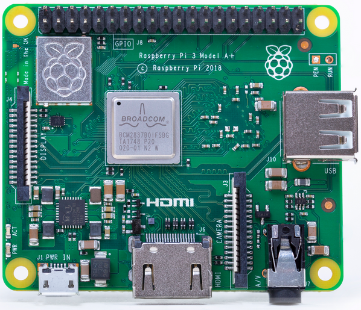

# Raspberry Pi 3 A+ and Zero 2 W

[](https://circleci.com/gh/nerves-project/nerves_system_rpi3a)
[](https://hex.pm/packages/nerves_system_rpi3a)

This is the base Nerves System configuration for the Raspberry Pi 3 Model A+
with the USB port running in gadget mode.


<br><sup>[Image credit](#rpi)</sup>

| Feature              | Description                     |
| -------------------- | ------------------------------- |
| CPU                  | 1.4 GHz quad-core ARM Cortex-A53|
| Memory               | 512 MB DRAM                     |
| Storage              | MicroSD                         |
| Linux kernel         | 6.1 w/ Raspberry Pi patches     |
| IEx terminal         | UART `ttyAMA0` Can be changed to HDMI |
| GPIO, I2C, SPI       | Yes - [Elixir Circuits](https://github.com/elixir-circuits) |
| ADC                  | No                              |
| PWM                  | Yes, but no Elixir support      |
| UART                 | 1 available - `ttyAMA0`         |
| Display              | HDMI or 7" RPi Touchscreen      |
| Camera               | Yes - via rpi-userland          |
| Ethernet             | No                              |
| WiFi                 | Yes                             |
| Bluetooth            | [See Bluetooth](#bluetooth)     |
| Audio                | HDMI out                        |

## Gadget mode on the 3A+!

The Raspberry Pi 3 Model A+ is supported by the official
[nerves_system_rpi3](https://github.com/nerves-project/nerves_system_rpi3), but
the USB port is configured to work as a host only. This Raspberry Pi can be
connected directly to your computer via a USB cable like the Raspberry Pi Zeros.
To do this, you'll need a USB A to USB A connector like
[this](https://www.monoprice.com/product?p_id=5443) or
[this](https://www.microcenter.com/product/431166/usb-a-to-a-high-speed-development-board-cable).

## Using

The most common way of using this Nerves System is create a project with `mix
nerves.new` and to export `MIX_TARGET=rpi3a`. See the [Getting started
guide](https://hexdocs.pm/nerves/getting-started.html#creating-a-new-nerves-app)
for more information.

If you need custom modifications to this system for your device, clone this
repository and update as described in [Making custom
systems](https://hexdocs.pm/nerves/customizing-systems.html).

## Supported WiFi devices

The base image includes drivers for the onboard Raspberry Pi 3 A+ wifi module
(`brcmfmac` driver).

## Bluetooth

[BlueHeronTransportUART](https://github.com/blue-heron/blue_heron_transport_uart)
supports Bluetooth on the Raspberry Pi 3 A+ or Zero 2 W using `ttyS0`. The
details are similar to the [RPi Zero W]
(https://github.com/nerves-project/nerves_system_rpi0/issues/224#issuecomment-913799838).

## Audio

The Raspberry Pi has many options for audio output. This system supports the
HDMI and stereo audio jack output. The Linux ALSA drivers are used for audio
output.

The general Raspberry Pi audio documentation mostly applies to Nerves. For
example, to force audio out the HDMI port, run:

```elixir
cmd("amixer cset numid=3 2")
```

Change the last argument to `amixer` to `1` to output to the stereo output jack.

## Linux's preempt_rt patches

If you need better real-time performance from the Linux kernel, the `preempt_rt`
patch set may help. Be aware that we do not test with the patches so this may
not work. To enable it, make a custom system using this one as a base and add
the following to the `nerves_defconfig`:

```text
BR2_LINUX_KERNEL_PATCH="http://cdn.kernel.org/pub/linux/kernel/projects/rt/4.19/patch-4.19.25-rt16.patch.xz"
```

Please verify the patch version since these instructions may be out-of-date.

Next, update the Linux configuration to use it. Review the Nerves documentation
for running `make linux-menuconfig` and enable `PREEMPT_RT_FULL`. Alternately,
make the following change to the Linux configuration:

```text
-CONFIG_PREEMPT=y
+CONFIG_PREEMPT_RT_FULL=y
 ```

Build the system and you should now have a preempt_rt kernel.

## Provisioning devices

This system supports storing provisioning information in a small key-value store
outside of any filesystem. Provisioning is an optional step and reasonable
defaults are provided if this is missing.

Provisioning information can be queried using the Nerves.Runtime KV store's
[`Nerves.Runtime.KV.get/1`](https://hexdocs.pm/nerves_runtime/Nerves.Runtime.KV.html#get/1)
function.

Keys used by this system are:

Key                    | Example Value     | Description
:--------------------- | :---------------- | :----------
`nerves_serial_number` | `"12345678"`      | By default, this string is used to create unique hostnames and Erlang node names. If unset, it defaults to part of the Raspberry Pi's device ID.

The normal procedure would be to set these keys once in manufacturing or before
deployment and then leave them alone.

For example, to provision a serial number on a running device, run the following
and reboot:

```elixir
iex> cmd("fw_setenv nerves_serial_number 12345678")
```

This system supports setting the serial number offline. To do this, set the
`NERVES_SERIAL_NUMBER` environment variable when burning the firmware. If you're
programming MicroSD cards using `fwup`, the commandline is:

```sh
sudo NERVES_SERIAL_NUMBER=12345678 fwup path_to_firmware.fw
```

Serial numbers are stored on the MicroSD card so if the MicroSD card is
replaced, the serial number will need to be reprogrammed. The numbers are stored
in a U-boot environment block. This is a special region that is separate from
the application partition so reformatting the application partition will not
lose the serial number or any other data stored in this block.

Additional key value pairs can be provisioned by overriding the default
provisioning.conf file location by setting the environment variable
`NERVES_PROVISIONING=/path/to/provisioning.conf`. The default provisioning.conf
will set the `nerves_serial_number`, if you override the location to this file,
you will be responsible for setting this yourself.

## Linux kernel and RPi firmware/userland

There's a subtle coupling between the `nerves_system_br` version and the Linux
kernel version used here. `nerves_system_br` provides the versions of
`rpi-userland` and `rpi-firmware` that get installed. I prefer to match them to
the Linux kernel to avoid any issues. Unfortunately, none of these are tagged by
the Raspberry Pi Foundation so I either attempt to match what's in Raspbian or
take versions of the repositories that have similar commit times.

## Installation

If you're new to Nerves, check out the
[nerves_init_gadget](https://github.com/nerves-project/nerves_init_gadget) project for
creating a starter project for the Raspberry Pi 3 Model A+. It will get you
started with the basics like bringing up the virtual Ethernet interface,
initializing the application partition, and enabling ssh-based firmware updates.

[Image credit](#rpi): This image is from [raspberrypi.org](https://www.raspberrypi.org/products/raspberry-pi-3-model-a-plus/).
